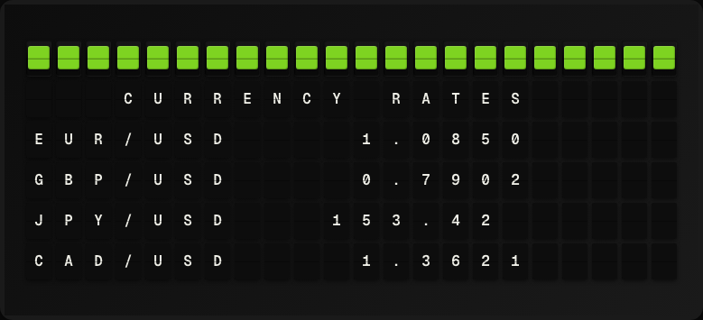

# Currency Exchange Plugin

Display live currency exchange rates using the Frankfurter API.



**→ [Setup Guide](./docs/SETUP.md)**

## Overview

The Currency Exchange plugin fetches the latest exchange rates from the Frankfurter API (api.frankfurter.dev), which is backed by the European Central Bank. Display rates for up to three target currencies relative to a base currency. No API key required.

## Template Variables

| Variable | Description | Example |
|---|---|---|
| `currency.base` | Base currency code | `USD` |
| `currency.rate_1_code` | First target currency code | `EUR` |
| `currency.rate_1_value` | Exchange rate for first target currency | `0.9234` |
| `currency.rate_2_code` | Second target currency code | `GBP` |
| `currency.rate_2_value` | Exchange rate for second target currency | `0.7912` |
| `currency.rate_3_code` | Third target currency code | `JPY` |
| `currency.rate_3_value` | Exchange rate for third target currency | `149.82` |
| `currency.date` | Date of the rates | `2026-05-01` |

## Example Templates

```
EXCHANGE RATES
Base: {{currency.base}}
{{currency.rate_1_code}}: {{currency.rate_1_value}}
{{currency.rate_2_code}}: {{currency.rate_2_value}}
{{currency.rate_3_code}}: {{currency.rate_3_value}}
{{currency.date}}
```

## Configuration

| Setting | Name | Description | Required |
|---|---|---|---|
| `base` | Base Currency | ISO 4217 currency code to convert from (e.g. USD). | Yes |
| `targets` | Target Currencies | Comma-separated ISO 4217 codes to show (e.g. EUR,GBP,JPY). | No |

## Features

- Frankfurter / ECB rates (no API key)
- Configurable base and target currencies
- Up to 3 target currencies displayed
- Daily rate updates

## Author

FiestaBoard Team
